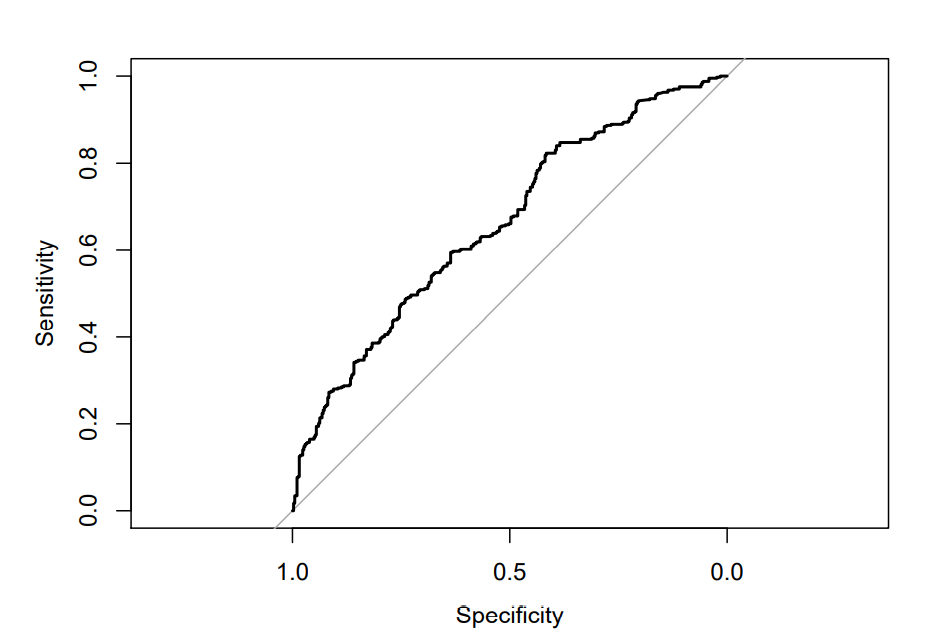

## This is a homework assignment for my data mining class. It's pretty straightforward, as you can see in the code.
        Question 1
        dta = read.csv('eBayAuctions(1).csv')
        set.seed(1)
        train.rows <- sample(rownames(dta), dim(dta)[1]*0.6)
        train.data <- dta[train.rows, ]
        valid.rows <- setdiff(rownames(dta), train.rows)
        valid.data <- dta[valid.rows, ]

        Question 2
        mod_1 = glm(Competitive ~ sellerRating+Duration+ ClosePrice+currency, data = train.data, subset = train.rows, family = "binomial")
        mod_1
        ##
        ## Call: glm(formula = Competitive ~ sellerRating + Duration + ClosePrice +
        ## currency, family = "binomial", data = train.data, subset = train.rows)
        ##
        ## Coefficients:
        ## (Intercept) sellerRating Duration ClosePrice currencyGBP
        ## 5.359e-01 -1.627e-05 -6.609e-02 1.191e-02 6.914e-01
        ## currencyUS
        ## -2.391e-01
        ##
        ## Degrees of Freedom: 1182 Total (i.e. Null); 1177 Residual
        ## Null Deviance: 1625
        ## Residual Deviance: 1541 AIC: 1553

        Question 3
        #The regression model reads as follows: Yˆ = 5.359e-01β0 + -1.627e-06β1 + -6.609e-02β2 + 1.191-03β3 + 6.914e-#01β4 + -2.391e-02 β5

        Question 4
        #Holding all else constant, for every 1 unit increase in the variable Duration (assumed to be days?) the log #odds of the given auction being competitive decreases by a factor of -6.609e-02
        #Holding all else constant, for an increase of one in the variable CurrencyGBP, the log odds of the given #auction being competitive increases by a factor of 6.914e-01 The same holds true for CurrencyUS, but the log #odds decrease by a factor of -2.391e-02

        Question 5
        #Predicted values for validation set.
        pred <- predict(mod_1, newdata = valid.data, type="response")

        Question 6
        #Below, we see the ROC for the validation dataset.
        library(caret)
        valid.data$pred = pred
        glm.pred <- ifelse(pred > 0.5, "1", "0")
        table(glm.pred, valid.data$Competitive)
        library(pROC)
        roc = roc(valid.data$Competitive, pred, plot=TRUE)

        #Predicted values for training set.
        pred2 <- predict(mod_1, newdata = train.data, type="response")
        library(caret)
        train.data$pred2 = pred2
        glm.pred2 <- ifelse(pred2 > 0.5, "1", "0")
        library(pROC)
        roc2 = roc(train.data$Competitive, pred2, plot=TRUE)

        Question 7
        Validation AUC
        roc$auc
        #Area under the curve: 0.6599
        ------------------------------
        Training AUC
        roc2$auc
        # Area under the curve: 0.661
