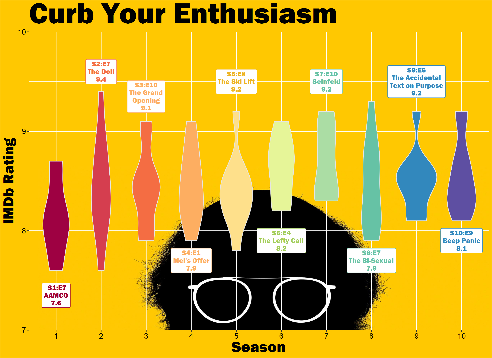

## I love Curb Your Enthusiasm (and you should, too!)

<figure>
  
  <figcaption>Pictured above: me telling my roommates how hungry I am but how little I want to actually cook something</figcaption>
</figure>

## In this post, I'll describe how I created a pretty basic IMDB score visualization.

This is the second visualization I've created using R-Studio! Refamiliarizing myself with the syntax of the language was a bit challenging, but having a [great example + accompanying code](https://isabella-b.com/blog/tidy-tuesday-the-office/) to use for guidance/inspiration helps like nothing else!

The data comes from IMDB, and I used [Jainajun7's Python webscraper](https://github.com/jainanuj7/IMDb-ratings-scraper/blob/master/IMDb.py) to write the data to a CSV file. From there, I just switched some variable names around, and imported the data in the same manner that Isabella did.

## Here it is!

I've never used (or even seen) the geom_violin function before, but I really liked how it looked, so I stuck with it! I took a shot at creating my own color palette (Isabella uses the Spectral color brewer, but I was hoping to create something that fit the 'curb' theme a little better,) but, as it turns out, I'm not a graphic designer, and I couldn't pull together a palette that I liked more than the default rainbow, so I stuck with it.

Honestly, most of the time spent on this project was devoted towards figuring out how to apply a background image in ggplot, as well as sizing everything correctly (again, it's all new to me!)

That being said, I like how it came out. It's definitely not perfect, and I don't know if I LOVE the violin function, but I think it's cool enough for a fun little project.

I showed some of my friends/family, and they were a bit confused by how to interpret the violin plot, and I had to explain it to them. While I think it's safe to assume that anyone who's reading this post will probably what it means, I'll explain it here, for my own sake:

>
By using a violin plot, we are able to illustrate the frequency of specific y-values, when grouped by a defined x-value (in this case, we're able to see the frequency of scores by season.) 

>
 - Looking at this graph, we note that season 1 has a wide midsection, thus, season 1 has many episodes that scored ~8.5/10 on IMDB.

>
 - Let's look at season 2. This violin is very narrow, which means that the scores ranged all over, and didn't sit in any particular scoring region.

I know that's not the best description ever, but I think the gist of it is pretty simple.

---

That's all for this post! I'm going to make another TV ratings visualization soon - they're so fun to make.

<figure>
  
  <figcaption>"Okay, seriously - how do I get graph lines to draw above the background image AND the violins???"</figcaption>
</figure>
