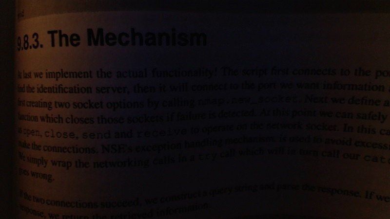

## Oh, the things computers enable us to do.

<figure>
  
</figure>

## Take a look at this image. Can you read what it says? Not really, right? Well, check this out. With the following chunk of `code`...

        import cv2
        import numpy as np

        img = cv2.imread('bookpage.jpg')
        retval, threshold = cv2.threshold(img, 12, 255, cv2.THRESH_BINARY)

        grayscaled = cv2.cvtColor(img, cv2.COLOR_BGR2GRAY)

        gaus = cv2.adaptiveThreshold(grayscaled, 255, cv2.ADAPTIVE_THRESH_GAUSSIAN_C, cv2.THRESH_BINARY,
                             115, 1)

        cv2.imshow('gaussian', gaus)

        cv2.waitKey(0)
        cv2.destroyAllWindows()

## Now you can!

<figure>
  
</figure>

## Isn't that sick? Thanks to sentdex for the awesome video series on using CV2.
