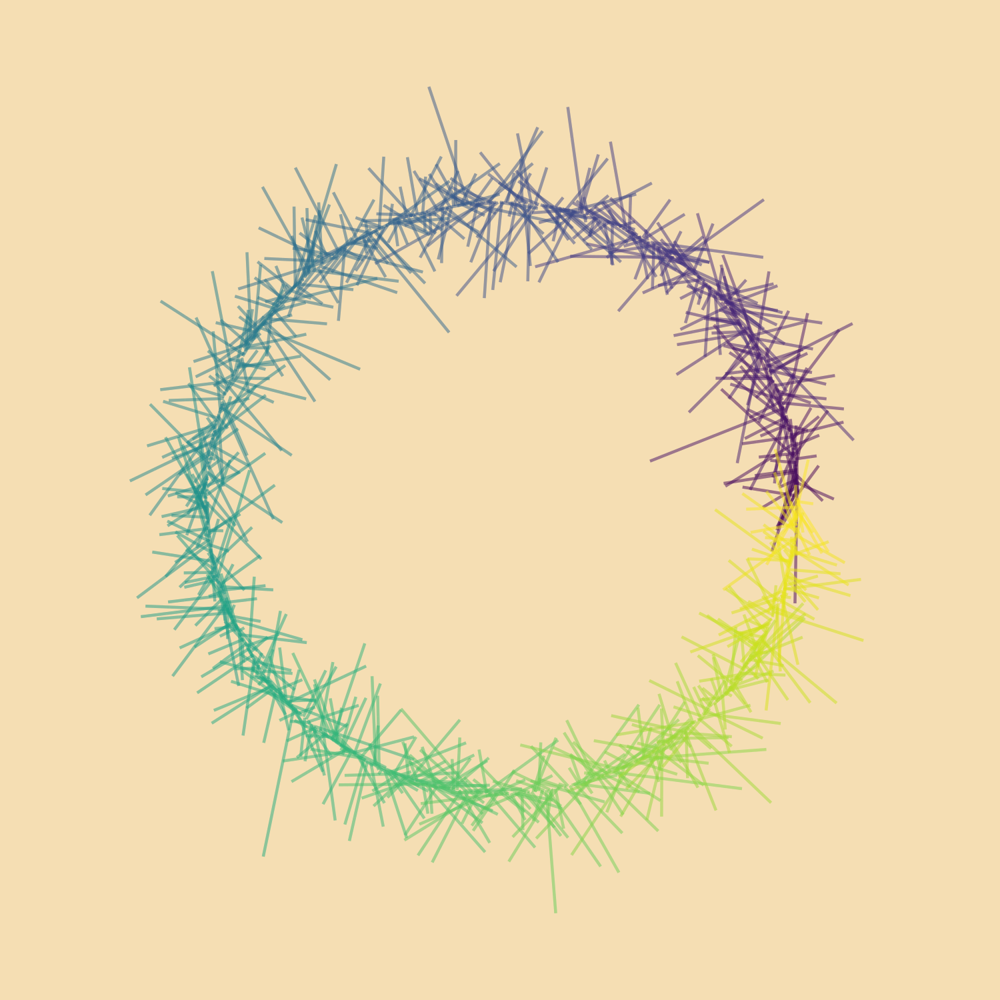
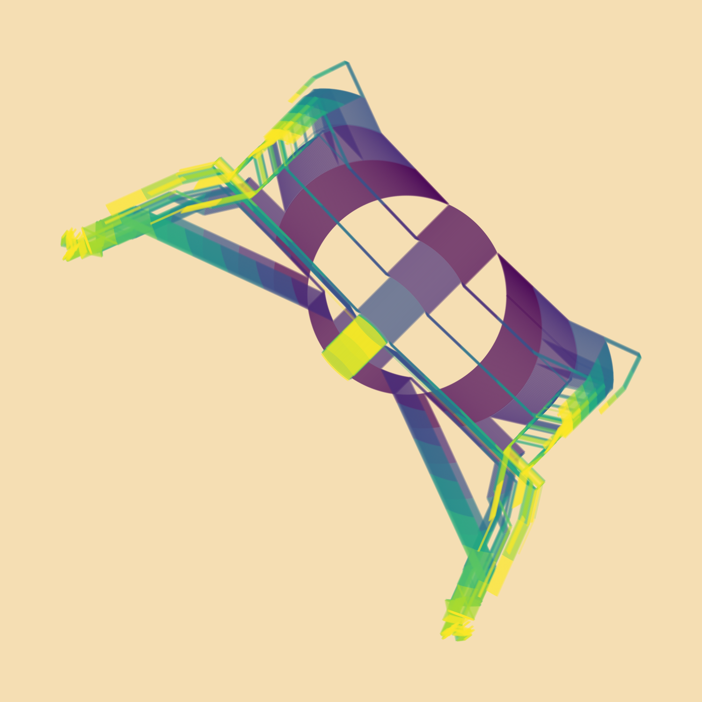
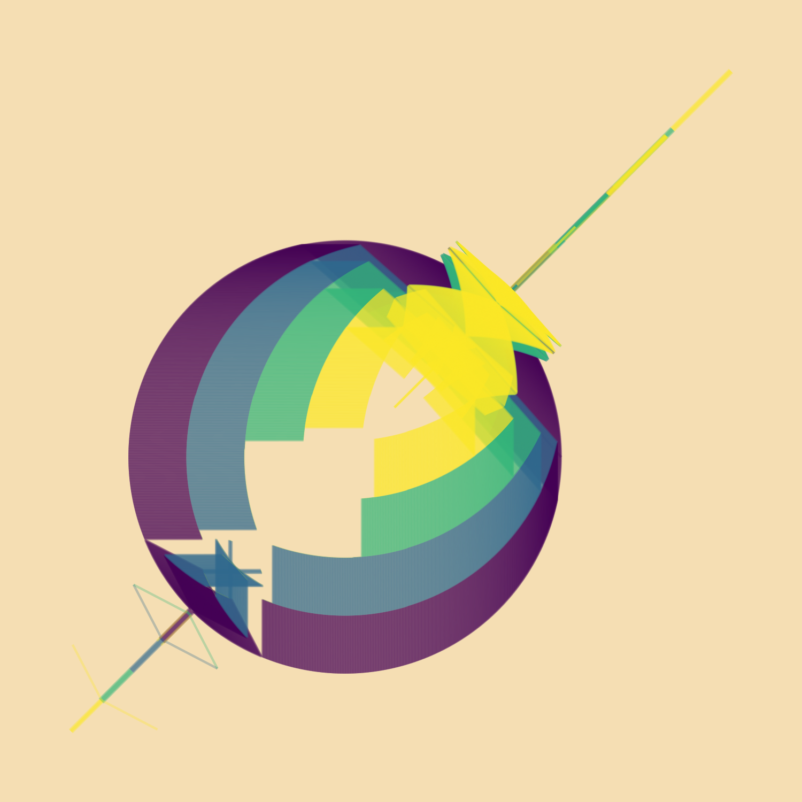
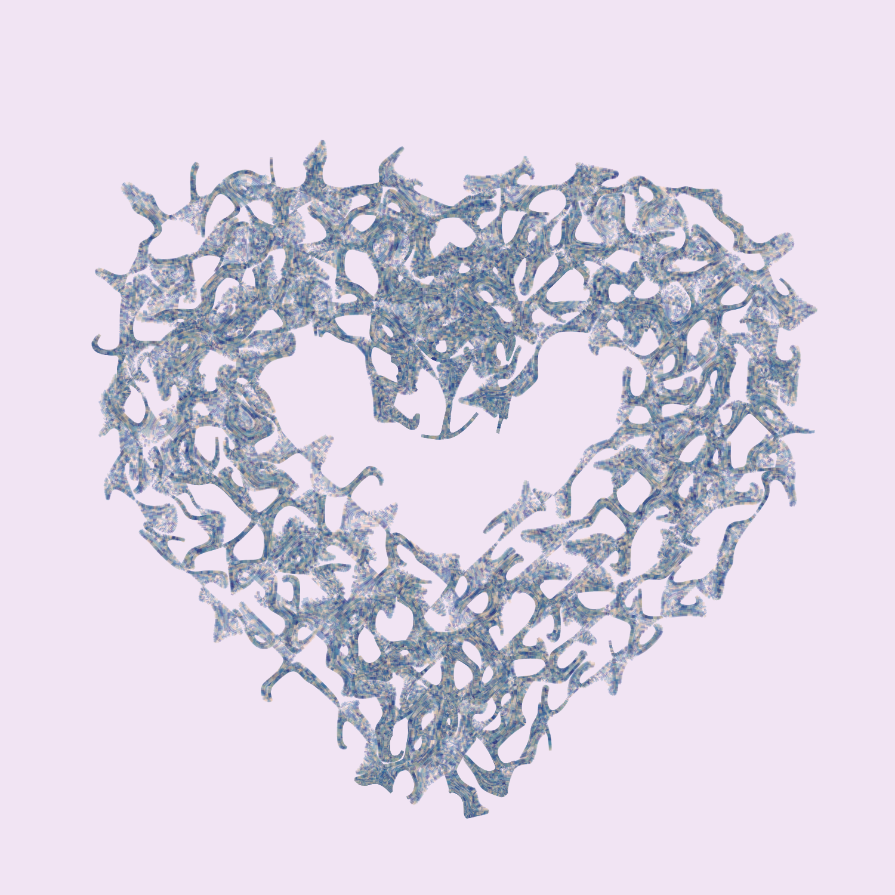

## It's been a while! The last semester of college has been filled with unexpected surprises;

## a two week full lockdown, a broken bike, and a lot more.

## ^^That list reads like something out of the song "Read My Mind" by The Killers, hahaha. Anyways, I'm trying to get back on the horse! It's too easy to slack.

---

## RStudio is so much fun to play with. I was reading Mine Çetinkaya-Rundel's blog post about her foray into generative art using the `jasmines` package, and it looked awesome, so I gave it a shot! Really fun to play with this package. I feel like an artist!!!

## Take a look at some of the pieces I put together!

| | | |
|:-------------------------:|:-------------------------:|:-------------------------:|
||
||
||
||
||

## Boop! The accompanying `code`...

        # from CRAN
        install.packages("tidyverse") # For data wrangling and visualisation
        install.packages("devtools")  # To install packages from GitHub
        install.packages("scico")     # Colour palettes based on the scientific colour-maps
        install.packages("TSP")       # Travelling salesperson problem

        # from GitHub
        devtools::install_github("mine-cetinkaya-rundel/addmins") # Mine's addins
        devtools::install_github("thomasp85/ambient")             # Generate multidimensional noise
        devtools::install_github("djnavarro/jasmines")            # Danielle's generative art
        devtools::install_github("djnavarro/flametree")           # Generate pretty trees
        devtools::install_github("cutterkom/generativeart")       # Create generative art with R

        library(tidyverse)
        library(jasmines)

        # cool viridis circle that looks like twigs or something
        use_seed(1738) %>%
          entity_circle(grain = 1000) %>%
          unfold_meander(iterations = 5) %>%
          style_ribbon(background = "wheat")
        ggsave("gen_1.png", device = "png", width = 5, height = 5, type = "cairo", dpi = 300)

        # weird spider slice style
        use_seed(1738) %>%
          entity_circle(grain = 1000) %>%
          unfold_slice(iterations = 10) %>%
          style_ribbon(background = "wheat")
        ggsave("gen_2.png", device = "png", width = 5, height = 5, type = "cairo", dpi = 300)

        # looks like a superhero logo, same slice style just different seed and grain
        use_seed(3) %>%
          entity_circle(grain = 2000) %>%
          unfold_slice(iterations = 5) %>%
          style_ribbon(background = "wheat")
        ggsave("gen_3.png", device = "png", width = 5, height = 5, type = "cairo", dpi = 300)

        use_seed(1738) %>%
          entity_heart(grain = 3000) %>%
          unfold_warp(iterations = 7) %>%
          style_ribbon(
            palette = "acton",
            colour = "",
            background = "mistyrose"
          ) %>%
          style_overlay(border = "seashell")
        ggsave("gen_4.png", device = "png", width = 5, height = 5, type = "cairo", dpi = 300)

        # cool grid function makes a 3x3
        use_seed(1738) %>%
          scene_grid(size = 5, grain = 2000, entity = "heart") %>%
          unfold_tempest(iterations = 11) %>%
          style_ribbon(
            palette = palette_named("lapaz"),
            background = "#F1E4F3")
        ggsave("gen_5.png", device = "png", width = 5, height = 5, type = "cairo", dpi = 300)

        # cool grid function makes a 3x3
        use_seed(1738) %>%
          scene_grid(size = 5, grain = 2000, entity = "gaussian") %>%
          unfold_tempest(iterations = 11) %>%
          style_ribbon(
            palette = palette_named("lapaz"),
            background = "pink")
        ggsave("gen_5.png", device = "png", width = 5, height = 5, type = "cairo", dpi = 300)

## Awesome! So glad I found this amazing package.
