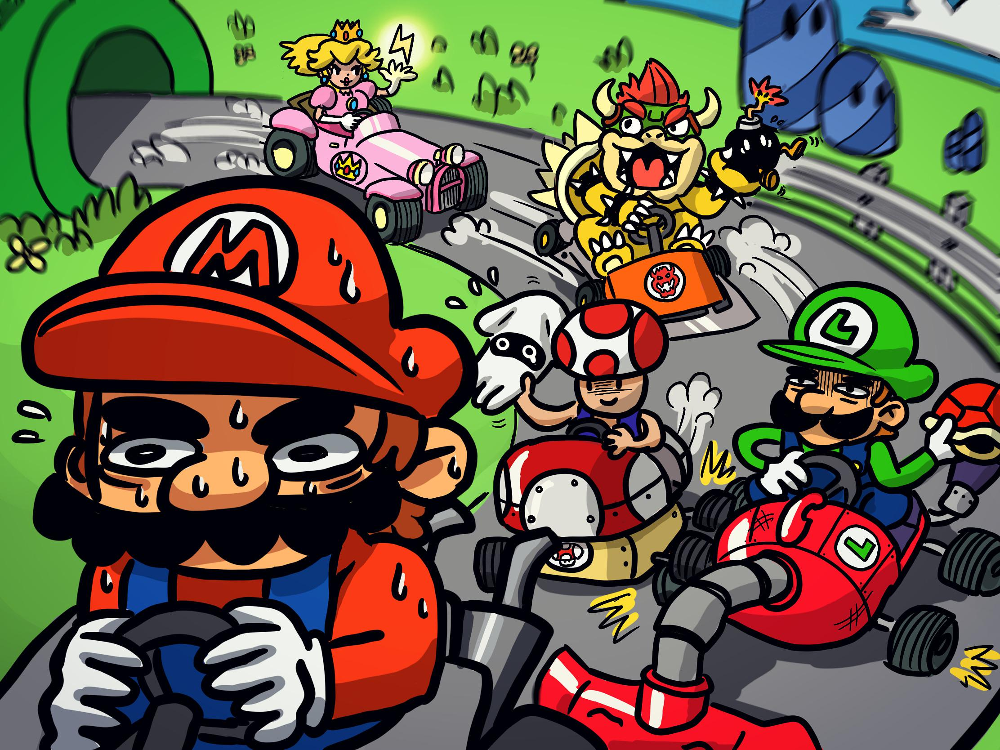
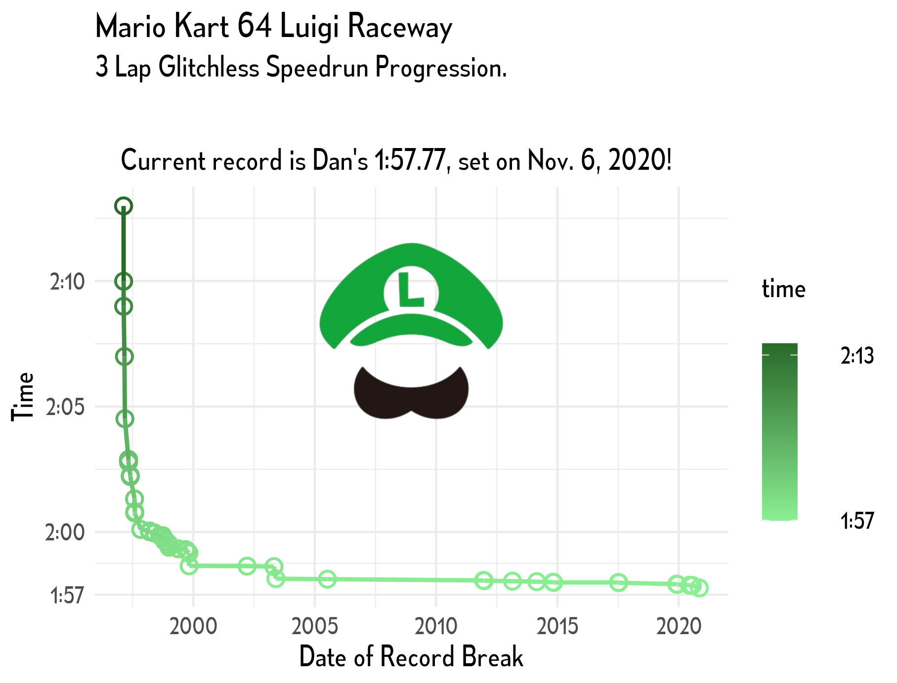
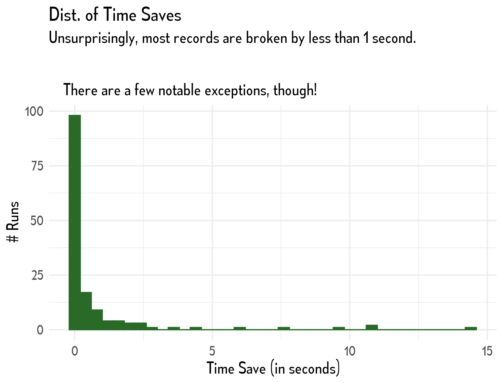
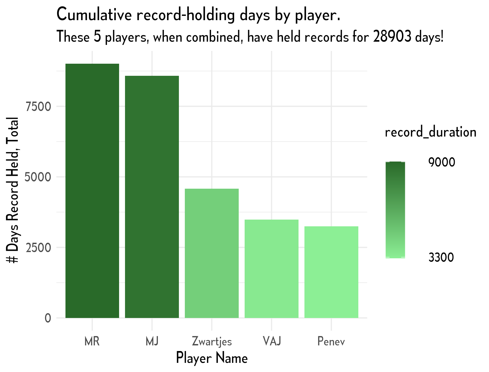

## After a nice trip to Washington state, I'm back in the swing of things, and ready to improve!

<figure>
  
</figure>

Tidy Tuesday is such a fantastic source of data for creating visualizations. There's such a broad range of datasets - this one focused on speedrun times from Mario Kart 64! I hardly remember playing the N64, but I like video games, so I figured I'd give it a shot.

I went for something a bit more subtle this time - most of my past visualizations are very "in your face," and I figure it's good to be able to do both. Emil Mata is one of my favorite twitter users (they make AMAZING visualizations), and I pulled my theme (fonts, sizing, background color) from his GitHub. Check out some of the INCREDIBLE work Emil does [here!](https://twitter.com/emilmalta)

## I created three graphs! Hopefully they're self-explanatory.
---

---

---

---

The biggest struggle I had with this visualization was probably the dataframe work. I had to manipulate some of the columns, and it was a lot of work I'd never done before. It was fun, though! A nice challenge. I had to write my first ever StackOverflow question! It was breathtaking. Jokes aside, it felt cool to be a part of that community. I tried to give back (by answering a question) but most of the stuff people need help with is way above my paygrade. Oh well!

## Thanks for reading, if you did!
---

<figure>
  
  <figcaption>This looks like a nice place to be! Hope you're having a great week.</figcaption>
</figure>
