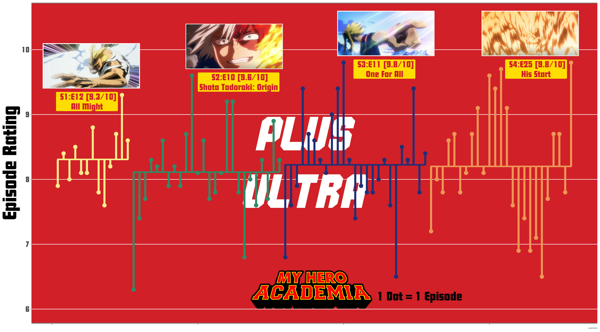

## My Hero Academia is a fun show! If you're looking for a cute intro to anime, this is as good a place to start as any.

<figure>
  
</figure>

## Just like my Curb Your Enthusiasm post, I'll describe how I made this viz.

This project is the third RStudio visualization I've put together now! I used Isabella's code as a framework for my own, but had to change up a few things that I wanted different. Honestly, the biggest problem I had with this project was getting the fonts to work. Such a hassle! At least I know how now, though. Thank goodness for stackoverflow.

Like last time, I pulled scores from IMDB, and used [Jainajun7's Python webscraper.](https://github.com/jainanuj7/IMDb-ratings-scraper/blob/master/IMDb.py)

## Anyway, here's the finished product!

I really like the aesthetic that I created. It's not quite what I had in mind when I was sketching it out on a notepad, but I'm a big fan of how it came together in the end. One thing I had trouble with was choosing a good color scheme for the data. I think I should look around to see if there are any color usage best practices.

---

That's all for this post! There's not much else to say. If you'd like to see my code, feel free to click the github link, or my projects page!

<figure>
  
  <figcaption>I hope your day is as wonderful as it would be to swim in these cotton candy clouds!</figcaption>
</figure>
