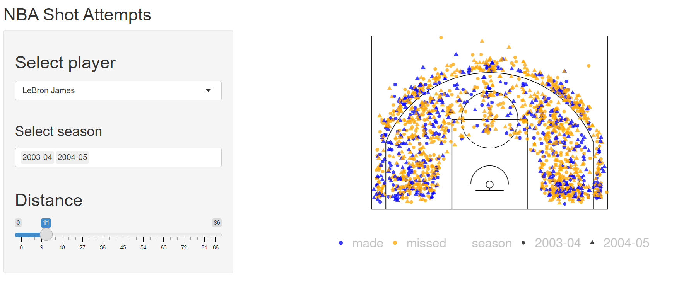
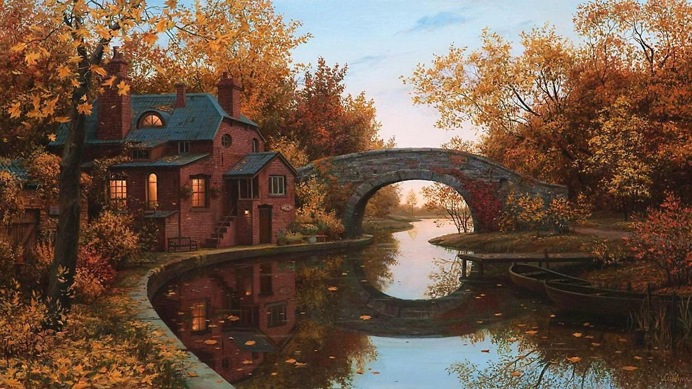

## I've been meaning to learn how to use RStudio's shinny apps for a while now, and when I saw [this tweet](https://twitter.com/icymi_r/status/1380810822235131905), I figured now was a good time to start!

## Note: The vast majority of the code that I've used here is pulled from Julia Wrobel's blog post, found [here](http://juliawrobel.com/tutorials/shiny_tutorial_nba.html), I made a few tweaks of my own.

<figure>
  
</figure>
---

## Rather than re-write the already elegant blog post from Julia, I think it makes more sense to just talk about the changes that I decided to make.

There were only two substantial changes that I made to original shiny app that was built by Julia.

1. I removed the made/missed filter. I found a way to filter by made OR missed, but I couldn't find a way to have them both show at the same time by default.
2. I added a slider to filter by year. This was a shot in the dark, to be honest, a lot of tweaking code. But it worked! And I like it. I love seeing the ring widen as you drag the slider upwards.

<figure>
  
</figure>

Check out the app [here!](https://xndrmcw.shinyapps.io/shiny_nba/)

Again, the only reason I was able to put this together was because of Julia's awesome blog post! Thanks to her, and to the "R Posts You Might Have Missed" twitter account, which you can check out [here!](https://twitter.com/icymi_r)

<figure>
  
  <figcaption>Beautiful little river scene. Makes me think of Cambridge! Boston really is charming.</figcaption>
</figure>
