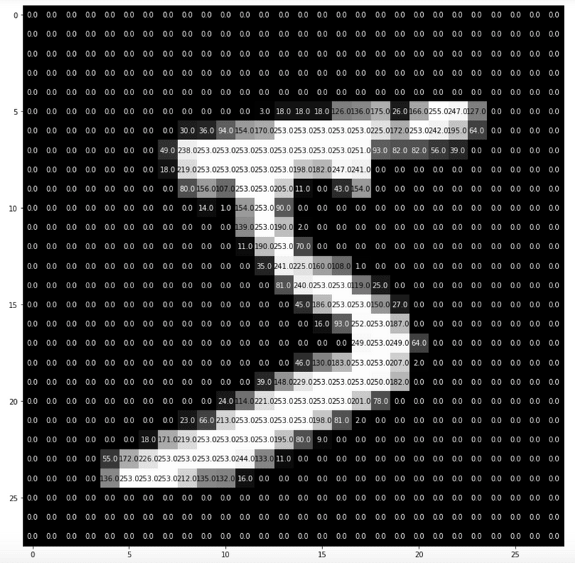

## Alright, let's do this.

There I was, messing around on GitHub, looking at a list of the most starred repo's of all time. TensorFlow sat at #4. I've been putting off learning more about TensorFlow for a while now, so, in the spirit of writing another blog post, I thought now might be a good time to get familiar!

## But where to start?

>
I guess a place as any would be with a working definition of what exactly TensorFlow is, and how it came to be.

## So, what is TensorFlow?

TensorFlow is an open-source software library for machine learning.

>
Well, okay, cool, but what does that really *mean*? I'll try my best to break it down...

Back in the early 2010's, Google Brain (a team of very smart AI researchers at Google) put together a compendium of machine learning tools. It was used widely by programmers at Google in both research and commercial capacities. It was called...

## DistBelief

>
TensorFlow is a cooler name, IMO. So, anyway, what does all that stuff above mean?

Put simply: DistBelief was pretty good at what it did. What exactly did it do? Hard to say. But Google's engineers liked to use it.

>
But, as with anything, there was room for improvement. So. Google execs assigned a few academic studs to make DistBelief into something that was Dist-Unbelieveable! Sorry... Anyways, Jeff Dean was one of those folk, although there were certainly other computer scientists working their tushies off as well! Jeff and the team transformed DistBelief into...

<figure>
  
  <figcaption>TensorFlow!</figcaption>
</figure>

>
This new version of DB was faster and more robust. After a few years, Google released TensorFlow 1.0 to the public! You can install and import it with your favorite Python IDE, as well as C++, Java, and a  few others.CHeck it out @ https://www.tensorflow.org/learn

Once it's imported, you have access to a bunch of fancy-shmancy machine learning tools! You can build, deploy, and make predictions with models, all from the comfort of your laptop! It's pretty sweet, honestly.

## Quick side note! This video series on neural networks by 3Blue1Brown is amazing! He makes complex subjects digestible and exciting. I highly recommend.

## But Alexander,

>
you might say,

## How does TensorFlow, a library of machine learning tools, help me as an amateur programmer?

Great question! If you're like me (a student,) you probably don't have much exposure to the many pragmatic uses of these tools! Don't worry, though - the internet is filled with information!

If you watched the videos from above, you're likely familiar with what a neural net is, how it works, and why it might be useful. If you didn't watch them, I suggest you reconsider!

Okay, so, assuming you've seen the video, you'll know what the MNIST database of handwritten digits is. If you don't, I'll do my best to explain it very simply. Take a look at the four numbers below:

<figure>
  
  <figcaption>"The numbers Mason, what do they mean?""</figcaption>
</figure>

These are handwritten digits, uploaded as image files. They're 28 x 28 pixels, and each pixel in the image has a "light value" somewhere between 0 and 1. For example: the whitest pixels in the center of the image have a light value of 1. The darkest pixels on the outside have a light value of 0 (there's no light in those pixels, thus, no light value!)

<figure>
  
  <figcaption>Take a look at this image! You can see there are values in each pixel. Ignore the fact that they're outside of the range of 0~1.</figcaption>
</figure>

There are 70,000 of these images, each painstakingly hand-labeled by a real person.

So, we have a huge collection of pictures of people's handwritten numbers, each with a corresponding label. What good is that, you might ask?

Well, with this dataset, we can use some tools to attempt to predict the label of each of the digits.

If we program our computer to take this image as an input:

<figure>
  
</figure>

Can we program it to predict the handwritten label that's associated with that image?

Let me rephrase:

## Can we teach a computer to recognize digits?

Short answer: yes.

Long answer: yes, but not really. Can we, with a high degree of accuracy predict the labels associated with the images correctly? Yes, absolutely. In some cases, we can predict with a 99%+ degree of accuracy. Still, though, does the computer really "learn" what a 5 is? Does it know that 7 is one greater than 6? No. All it "knows" is that certain pixel values and arrangements correspond to 5's, 6's, and 7's. It's a smart labelling system, but that's all it is.

Does it really matter, though? Does a computer need to deeply "know" what those things are, in order for it to carry out commands? No, in this case, it doesn't. There would be no difference between a computer's performance in labelling and a human's.

Of course, there are things that humans can do that computers just can't compare to yet.

<figure>
  
  <figcaption>Here's something that might make you feel better! This is a map from Max Tegmark's book, Life 3.0, that illustrates the varying levels of difficulty that AI have performing certain tasks. It's an awesome book! Check it out. https://www.amazon.com/Life-3-0-Being-Artificial-Intelligence/dp/1101946598</figcaption>
</figure>

>
A computer can predict digits, do math, and win at chess, but it can't yet write consistently convincing and engaging literature. With time, though, who knows? Maybe your grandchild's favorite novel will be written by an intelligent machine at Google.

So, now that we're familiar with the MNIST digits dataset, we could, in theory, download the dataset, use some of the tools present in TensorFlow, and build ourselves a predictive model!

Instead of that, though, let's use a slightly more interesting dataset! The MNIST-Fashion database follows the exact same neural-net based process as the digit database, but rather than handwritten digits we have 70,000 hand-labelled images of clothing! TensorFlow provides a nice tutorial for building a predictive model using this model. Let's walk through it! Get ready for some `code!`

>
First, let's import the packages we need. If you don't have any of these installed, a quick google search will help you.

        import tensorflow as tf
        import numpy as np
        import matplotlib.pyplot as plt

>
Next, we'll load in the dataset!

        fashion_mnist = tf.keras.datasets.fashion_mnist

>
Now, we'll use the load.data() function. This will return four values (training images/labels and test images/labels), so we need to assign them to corresponding variables. 

        (train_images, train_labels), (test_images, test_labels) = fashion_mnist.load_data()

>
Let's create a list of label names. The actual MNIST dataset only labels the images with "1" - "9", so let's add some actual words, so we know what we're looking at.

        class_names = ['T-shirt/top', 'Trouser', 'Pullover', 'Dress', 'Coat',
                       'Sandal', 'Shirt', 'Sneaker', 'Bag', 'Ankle boot']

>
As a quick check that we're doing things right, let's check how many images we have, as well as the dimensions of the images.

        print(train_images.shape)
        (60000, 28, 28)

>
Lovely! We have 60,000 images in our training set, all of dimension 28x28. Let's see what they look like! 

        plt.figure()
        plt.imshow(train_images[0])
        plt.colorbar()
        plt.grid(False)
        plt.show()

<figure>
  
  <figcaption>Take a look! The original images are in a binary color scheme (black and white), but matplotlib defaults to using the viridis color scheme. Per the legend, if a pixel in the image is close to being yellow, it has a light value of 255, and if it's close to being purple, it has a light value of 0. I mentioned this before, but we want our range to be 0 to 1, not 0 to 255. So, let's divide the pixel values by 255!</figcaption>
</figure>

        train_images = train_images / 255
        test_images = test_images / 255

>

With TensorFlow, you can train a model to predict digits yourself! That's pretty cool, but the TensorFlow documentation page suggests you trying something with a bit more spice.
