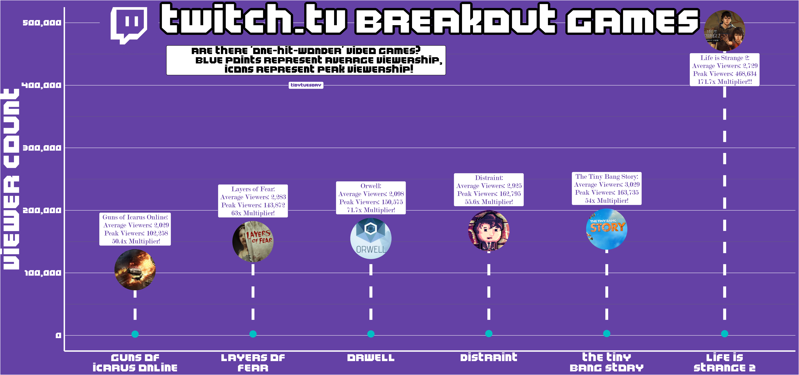

## I'm back! Done with school, and ready to get back to working on projects. I made this visualization a while back, but never got around to posting it.

<figure>
  
</figure>

Twitch.TV is a popular streaming site. Most streamers play video games, but there's a diversity of stream types out there. This dataset is from tidytuesday, a few weeks back. Maybe months, I forget. Link above! Anyways, I used dplyr to filter for games that had a peak viewership 50x the average viewership of the game, because I wanted to know if there were "breakout" games.

## Here's the image! If the resolution is wonky, right click the image then open in a new tab. I'm working on getting the ggsave resolutions right.

This viz was fun to make, but I feel like I got more from this project than just something to post on my website - I'm finding a bunch of really cools tools that I can use to make the visualizations better. The only thing that I'm looking to improve on is my time spent building. I feel like there are a bunch of things that I'm super specific about that probably don't matter that much. Or, if they do, there are probably packages/tools I can use to fix those things faster. Oh well, I guess that's something I'll figure out with time!

---

<figure>
  
  <figcaption>Lovely.</figcaption>
</figure>
